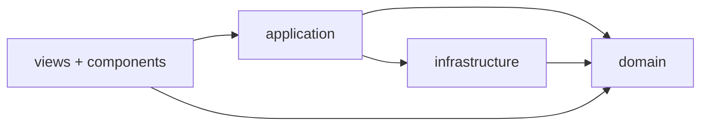

# Frontend architecture (DDD-aligned)

Источник истины по раскладке Vue-приложения после миграции (апрель 2026). Агрегаты и термины согласованы с [aggregates.md](./aggregates.md).

## Целевая структура

```text
frontend/src/
  domain/              # чистый TypeScript: типы, чистые функции, без Vue/Pinia/axios/vue-i18n
    user/ project/ task/ report/ session/
  infrastructure/    # внешние зависимости
    http/client.ts   # axios + refresh
    api/             # тонкие обёртки над HTTP по срезам (auth, users, projects, tasks, reports)
    i18n/            # createI18n, labels (enum → строка)
    formatters/      # даты / timeAgo (с vue-i18n Composer)
  application/       # сценарии (Pinia-сторы + composables)
    *.store.ts
    composables/
  components/        # interface: презентация
  views/
  router/
```

## Поток зависимостей



- **`domain/`** не импортирует `application/`, `infrastructure/`, `components/`, `views/`.
- **`infrastructure/`** не импортирует `application/`.
- **`components/`** и **`views/`** не вызывают `axios` напрямую и не импортируют `@infra/http/client`; HTTP только через `@infra/api/*` в сторах/composables (или через функции из `@infra/api/*` там же, где разрешено политикой проекта).

## Path-алиасы

См. `frontend/tsconfig.app.json` и `frontend/vite.config.ts`:

- `@/*` → `src/*`
- `@domain/*` → `src/domain/*`
- `@infra/*` → `src/infrastructure/*`
- `@app/*` → `src/application/*`

## Соответствие backend-агрегатам

| Backend (`backend/internal/...`) | Frontend (`frontend/src/domain/...`) |
|-----------------------------------|----------------------------------------|
| `domain/user`                     | `domain/user`                        |
| `domain/project`                | `domain/project`                     |
| `domain/task`                   | `domain/task`                        |
| `domain/report`                 | `domain/report`                    |
| `domain/session` (locale и т.п. на клиенте) | `domain/session`           |

## Changelog

| Дата       | Изменение |
|------------|-----------|
| 2026-04-18 | Введены слои `domain/`, `infrastructure/`, `application/`; перенос типов и чистой логики из `types/` и `utils/`; HTTP-клиент в `infrastructure/http/client.ts`, API-срезы в `infrastructure/api/*`; i18n и formatters в `infrastructure/`; Pinia и composables в `application/`; алиасы `@domain`, `@infra`, `@app`. |
