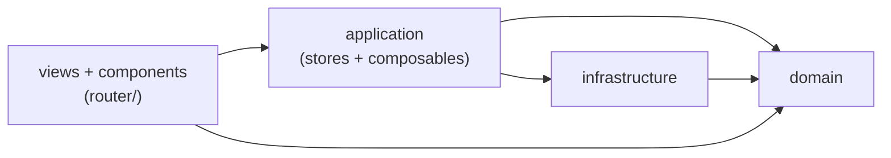

# Архитектура: DDD-слои

Клиентское приложение следует Domain-Driven Design (DDD) принципу разделения ответственности на четыре явных слоя. Источник истины — [`docs/architecture/frontend.md`](../architecture/frontend.md); правило для агента — [`.cursor/rules/14-frontend-ddd.mdc`](../../.cursor/rules/14-frontend-ddd.mdc).

## Диаграмма потока зависимостей



Нижележащие слои **не импортируют** вышележащие. Направление стрелок — единственно допустимое.

## Слои и правила импортов

### `domain/`

```
frontend/src/domain/
```

- Содержит **только чистый TypeScript**: интерфейсы, type-алиасы, pure-функции.
- **Запрещено**: импортировать `vue`, `pinia`, `axios`, `vue-i18n`; импортировать из `application/`, `infrastructure/`, `components/`, `views/`.
- Может импортировать только другие файлы внутри `domain/`.

### `infrastructure/`

```
frontend/src/infrastructure/
```

- HTTP-клиент (`http/client.ts`), API-обёртки (`api/*`), i18n, formatters.
- Может импортировать `domain/`.
- **Запрещено**: импортировать `application/`.

### `application/`

```
frontend/src/application/
```

- Pinia-сторы (`*.store.ts`) и composables (`composables/`).
- Реализует сценарии приложения: вызывает `@infra/api/*`, использует типы из `@domain/*`.
- Может импортировать `domain/` и `infrastructure/`.

### UI-слой: `components/`, `views/`, `router/`

```
frontend/src/components/
frontend/src/views/
frontend/src/router/
```

- Импортируют `@app/*` для хранения состояния и вызова действий.
- Импортируют `@domain/*` для типов и domain-функций.
- Могут импортировать `@infra/*` (i18n, formatters, api-срезы), **но**:
  - **Запрещено** напрямую импортировать `@infra/http/client`.
  - Прямые вызовы `@infra/api/*` допустимы по правилу `.cursor/rules/14-frontend-ddd.mdc`, но предпочтительно проводить через сторы `@app/*` (что реализовано для `@infra/api/reports` и `@infra/api/users`).

## Текущее состояние соответствия

После введения `useReportStore` и `useUserStore` весь HTTP-доступ к `/reports` и `/users` из UI-слоя проходит через `@app/*`. Исключение: `useAdminAssignableUsers.ts` в `application/composables/` использует `@infra/api/users` напрямую — это допустимо, так как файл находится в слое `application/`.

## Соответствие backend-агрегатам

| Backend (`backend/internal/...`) | Frontend (`frontend/src/domain/...`) |
|----------------------------------|--------------------------------------|
| `domain/user` | `domain/user` |
| `domain/project` | `domain/project` |
| `domain/task` | `domain/task` |
| `domain/report` | `domain/report` |
| *(нет прямого аналога)* | `domain/session` (локаль клиента) |

Подробнее: [`docs/architecture/aggregates.md`](../architecture/aggregates.md).
