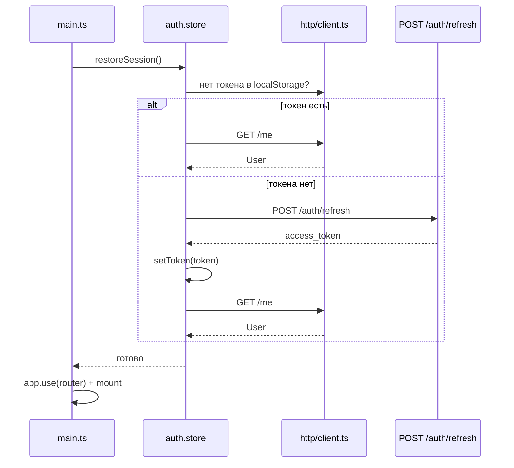
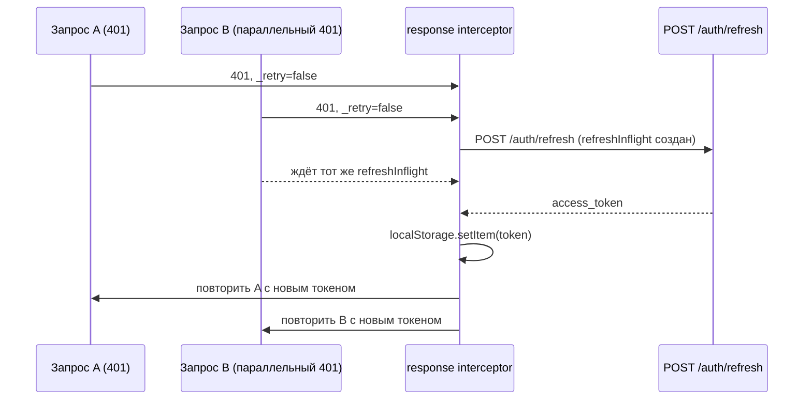
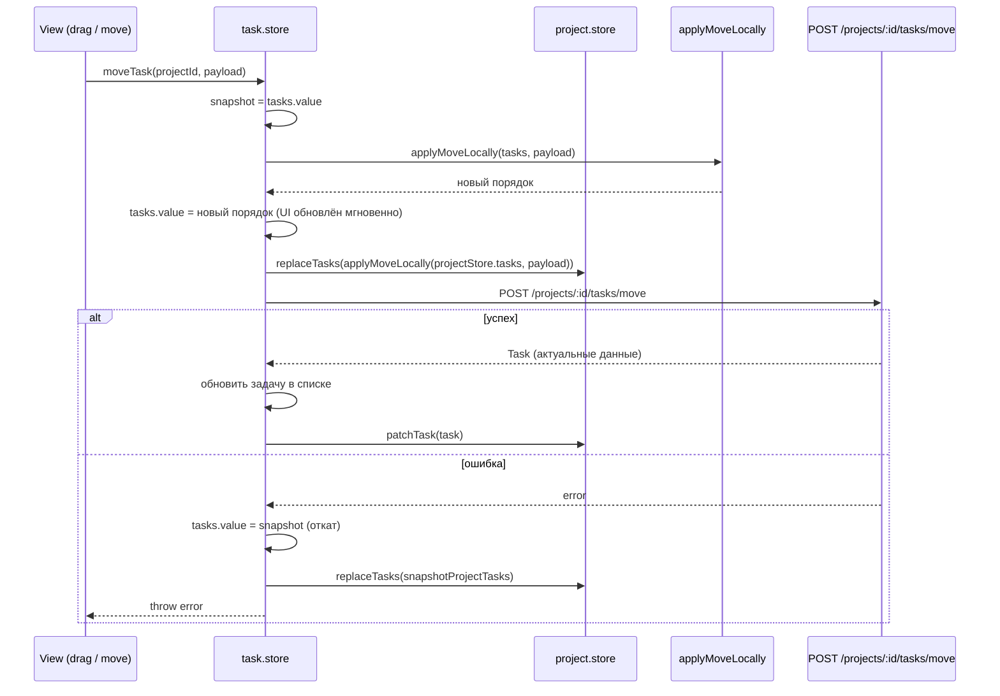
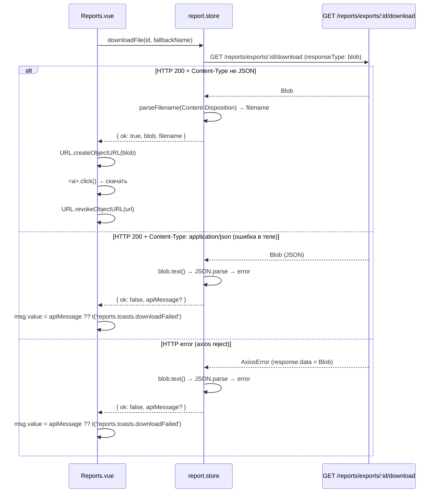
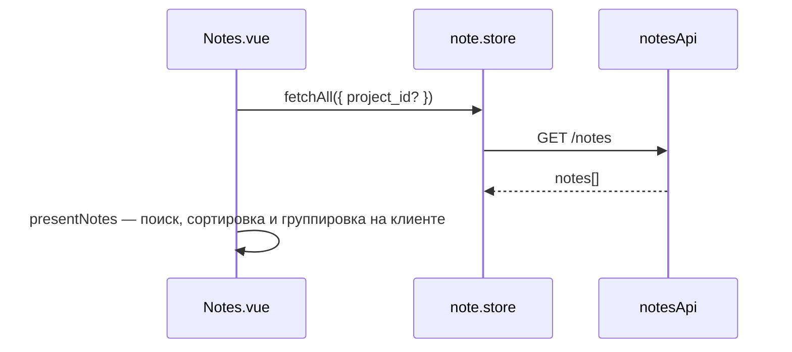
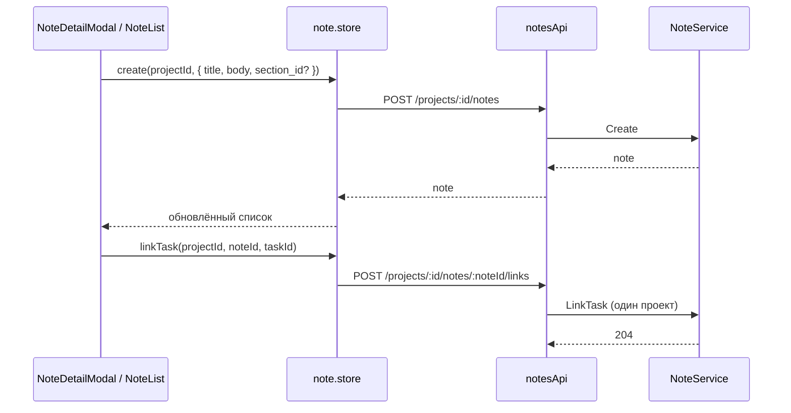

# Ключевые data-flows

Три сценария, в которых важна последовательность вызовов через несколько слоёв.

---

## 1. Аутентификация и автоматическое обновление токена

### Bootstrap (при загрузке страницы)

### Single-inflight refresh при 401

При неудаче `POST /auth/refresh` — `localStorage.removeItem(AUTH_TOKEN_KEY)`, оба запроса отклоняются.

---

## 2. Перемещение задачи (optimistic update + rollback)

Реализовано в [`task.store.ts`](../../frontend/src/application/task.store.ts) — `moveTask(projectId, payload)`.

---

## 3. Скачивание сохранённого отчёта

Разбит на стор и view: стор возвращает blob или описание ошибки; DOM-операцию (`<a>.click()`) делает view.

Имя файла из заголовка `Content-Disposition` разбирается `parseFilename` (приватная функция в `report.store.ts`):
1. `filename="..."` — прямое имя
2. `filename*=UTF-8''...` — RFC 5987, `decodeURIComponent`
3. fallback — `display_name || 'report.<format>'`

---

## 4. Заметки: создание, связь с задачей, корзина, порядок

### Глобальный список (`/notes`)

Создание с страницы: `NoteForm` с `projects[]` → `POST /projects/:id/notes` для выбранного проекта. Реордер на этой странице не показывается (он остаётся в контексте проекта).

### Создание и привязка задачи

### Мягкое удаление и восстановление

- `DELETE /projects/:id/notes/:noteId` — заметка в корзине (soft-delete).
- `POST /projects/:id/notes/:noteId/restore` — восстановление.
- `DELETE ...?permanent=true` — безвозвратно. Список удалённых: `GET /projects/:id/trash/notes`.

### Drag-and-drop порядка внутри / между секциями

`NoteList` собирает новый порядок id по секциям и вызывает `reorderNotes`: для затронутых секций позиции применяются **снизу вверх**, затем `fetchList` для согласования с БД.
