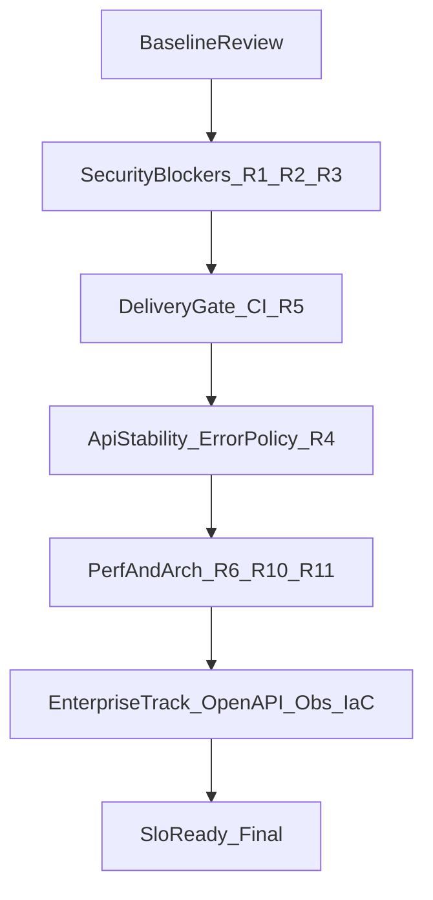

# Полный технический аудит репозитория ProjectHub

**Дата:** 2026-04-20  
**Охват:** весь репозиторий (backend Go + frontend Vue 3, инфраструктура и процессы поставки).  
**Приоритеты анализа:** архитектура, безопасность, производительность, UI/UX (включая i18n и состояние приложения).

**Дополнение:** после закрытия базового roadmap (§7) см. **§10 — стратегия «Идеальный продукт» (Enterprise-readiness)**: миграции схемы БД, контракт API, наблюдаемость, пирамида тестов на фронте, IaC и security-сканирование в CI.

**Финальная часть документа (§11–§14):** code-evidence по top-рискам, зависимый порядок внедрения, Definition of Done по инициативам и план на 90 дней по спринтам — для прямого превращения review в исполнимую дорожную карту.

---

## 1. Методика и критерии

### 1.1 Как проводилось ревью

- Анализ структуры пакетов, границ слоёв (domain / application / interface / infrastructure).
- Чтение ключевых точек входа: конфигурация, middleware, HTTP-слой, клиент Axios, bootstrap фронта.
- Сопоставление с документацией в `docs/architecture/` и `docs/frontend/`.
- Поиск типовых рисков: утечки ошибок, небезопасные дефолты, N+1, связность модулей, отсутствие автоматизации качества.

### 1.2 Шкала severity (единая для всего документа)

| Уровень | Значение |
|--------|----------|
| **Critical** | Эксплуатация в проде с высокой вероятностью приводит к компрометации данных, обходу авторизации или полной недоступности при типовой ошибке конфигурации. |
| **High** | Значимый риск безопасности, целостности или устойчивости; или архитектурный долг, который быстро «разрастается». |
| **Medium** | Риск при определённых условиях, деградация UX/perf, усложнение сопровождения. |
| **Low** | Косметика, мелкие улучшения, долгосрочная гигиена. |

### 1.3 Оценка сложности внедрения (для roadmap)

- **S** — до ~1 дня  
- **M** — несколько дней  
- **L** — неделя и более (возможен рефакторинг)

---

## 2. Executive summary

### 2.1 Сильные стороны

1. **Доменная модель и документация:** подробный [`docs/architecture/aggregates.md`](architecture/aggregates.md) с границами агрегатов, инвариантами и changelog — редкая зрелость для небольшого продукта.
2. **Разделение слоёв на backend:** домен без GORM/Gin; централизованное маппирование ошибок в [`backend/internal/interface/http/context.go`](../backend/internal/interface/http/context.go) (`handleServiceError` / `mapServiceError`) со стабильными кодами API.
3. **Frontend:** явные алиасы `@domain` / `@app` / `@infra`, единый HTTP-клиент с refresh и single-inflight [`frontend/src/infrastructure/http/client.ts`](../frontend/src/infrastructure/http/client.ts), проверка i18n в сборке (`i18n-check` в [`frontend/package.json`](../frontend/package.json)).
4. **Локальная поставка:** Docker, Makefile, healthcheck бэкенда, разделение dev/prod compose.
5. **Тесты на backend:** множество `*_test.go` по домену, application и части HTTP (см. раздел 5).

### 2.2 Критичные и высокие риски (кратко)

| ID | Severity | Тема | Суть |
|----|----------|------|------|
| R1 | **Critical** | Конфиг | Пустой `JWT_SECRET` подставляет известный dev-секрет — риск при ошибочном деплое. [`backend/internal/config/config.go`](../backend/internal/config/config.go) |
| R2 | **High** | AuthZ | `SyncRoleFromDB` при ошибке БД не сбрасывает сессию — возможна рассинхронизация роли JWT и БД. [`backend/internal/middleware/auth.go`](../backend/internal/middleware/auth.go) |
| R3 | **High** | Frontend | Open redirect после логина через `?redirect=`. [`frontend/src/views/Login.vue`](../frontend/src/views/Login.vue) |
| R4 | **High** | HTTP | Прямая отдача `err.Error()` клиенту в ряде хэндлеров (500/404), обход стабильных кодов. Напр. [`project_handler.go`](../backend/internal/interface/http/project_handler.go), [`user_handler.go`](../backend/internal/interface/http/user_handler.go), [`member_handler.go`](../backend/internal/interface/http/member_handler.go) |
| R5 | **High** | Delivery | В репозитории нет CI workflow (`.github/workflows` и аналогов) — нет обязательного `go test` / сборки фронта на каждый merge. |

### 2.3 Общая зрелость

**Архитектура и предметная модель — выше среднего** за счёт DDD-документации и чистого домена. **Эксплуатационная и security-зрелость — средняя:** сильные идеи (refresh в cookie, маппинг ошибок), но есть «острые углы» (дефолтный секрет, неполная унификация ошибок HTTP, отсутствие CI). **Frontend — сильный UX-стек**, но есть риски безопасности (redirect, токен в `localStorage`) и perf-нюансы (ключ роутера, лишние запросы).

### 2.4 Vision «идеального продукта»

Текущий документ закрывает **гигиену и базовый промышленный минимум** (§7). Вектор развития до уровня enterprise (контракты API, версионирование схемы, глубокая наблюдаемость, E2E, IaC) вынесен в **§10** — его имеет смысл планировать после стабилизации CI и критичных security-задач.

---

## 3. Backend

### 3.1 Архитектура

**Что хорошо**

- Соответствие целевой структуре из [`docs/architecture/aggregates.md`](architecture/aggregates.md): `domain/*`, `application/*`, `infrastructure/persistence/*`, `interface/http`.
- Явные cross-aggregate сценарии (`ProjectDeletionService`, `MemberRemovalService`, `TaskMoveService` и т.д.) задокументированы в таблице транзакций.

**Замечания**

| Severity | Проблема | Где | Рекомендация |
|----------|----------|-----|--------------|
| **High** | Application импортирует конкретные пакеты infrastructure (`auth`, `persistence/*`, `reportexport`) — нарушение строгой onion/hex границы. | Напр. [`auth_service.go`](../backend/internal/application/auth_service.go), [`reporting_service.go`](../backend/internal/application/reporting_service.go), [`project_deletion_service.go`](../backend/internal/application/project_deletion_service.go) | Вынести порты в `domain` или `application/ports`: JWT-подпись, экспорт отчётов, транзакции/UoW; wiring только в `cmd/server` или `internal/wiring`. |
| **Medium** | Дублирование политики ошибок: часть путей через `handleServiceError`, часть — ручной JSON с `err.Error()`. | См. §3.2 | Единый ответ для всех защищённых маршрутов. |

### 3.2 Безопасность

| Severity | Проблема | Где | Рекомендация |
|----------|----------|-----|--------------|
| **Critical** | Дефолтный `JWT_SECRET` при пустом env. | [`config.go`](../backend/internal/config/config.go) L65–68 | В `GIN_MODE=release` / `ENV=production`: **fail fast**, если секрет пустой или в denylist известных dev-значений. В dev — явный флаг `ALLOW_INSECURE_JWT=1`. |
| **High** | После валидного JWT роль из БД не подставляется при ошибке `FindByID` — запрос продолжается с ролью из токена. | [`auth.go`](../backend/internal/middleware/auth.go) `SyncRoleFromDB` L50–53 | При ошибке репозитория: 401 или принудительная инвалидация; для admin-маршрутов — повторная проверка роли из БД в handler/service. |
| **Medium** | Нет rate limiting на auth-эндпоинтах. | [`router.go`](../backend/internal/httpserver/router.go) | Middleware по IP (и опционально по email) на `login` / `register` / `refresh`. Уже отмечено в [`docs/todo.md`](todo.md). |
| **Medium** | Cookie refresh: убедиться в явном `SameSite` / `Secure` в [`auth_handler`](../backend/internal/interface/http/auth_handler.go) (не дублировать здесь — проверить при правках). | См. `docs/todo.md` CSRF | Согласовать с моделью угроз SPA + proxy. |

**Утечки внутренних ошибок в HTTP**

- `handleServiceError` корректно скрывает `detail` в release для маппируемых ошибок ([`context.go`](../backend/internal/interface/http/context.go)).
- Но ряд хэндлеров возвращает `gin.H{"error": err.Error()}` на 500/404 без унификации — риск утечки SQL/стека при сбоях инфраструктуры. Примеры: [`project_handler.go`](../backend/internal/interface/http/project_handler.go) (List), [`user_handler.go`](../backend/internal/interface/http/user_handler.go), [`member_handler.go`](../backend/internal/interface/http/member_handler.go).

**Рекомендация:** любой неожиданный `error` → лог с correlation id + клиенту стабильный код `internal_error` без сырого текста в production.

### 3.3 Производительность и масштабирование

| Severity | Проблема | Где | Рекомендация |
|----------|----------|-----|--------------|
| **Medium** | SQLite + `SetMaxOpenConns(1)` — естественный потолок параллелизма. | [`database.go`](../backend/internal/database/database.go) | Документировать лимиты; для роста — Postgres/MySQL и миграции. |
| **Medium** | Потенциальный N+1: список проектов / участников с подгрузкой сущностей по одной. | Логика в [`project_service.go`](../backend/internal/application/project_service.go), хэндлеры | Batch-запросы ролей и пользователей (`IN (...)` / join в репозитории). |
| **Medium** | Отчёты: несколько тяжёлых проходов по данным. | [`taskstore/report_query.go`](../backend/internal/infrastructure/persistence/taskstore/report_query.go) | Объединить агрегации в минимальное число SQL; кэш/материализация для дашборда при необходимости. |

### 3.4 Тестирование

- **Покрыто хорошо:** домен (user, project, task, note, report), часть application, многие HTTP-хэндлеры — см. список в репозитории (`backend/**/*_test.go`, ~32 файла).
- **Пробелы:** нет выделенных тестов на `SyncRoleFromDB`-поведение при сбое БД; стоит добавить интеграционные/httptest сценарии для ACL и стабильности ответов при 5xx.

---

## 4. Frontend

### 4.1 Архитектура и состояние

**Сильные стороны**

- Карта слоёв и bootstrap описаны в [`docs/frontend/overview.md`](frontend/overview.md).
- Pinia + composables, разделение domain/infrastructure/application.

**Замечания**

| Severity | Проблема | Где | Рекомендация |
|----------|----------|-----|--------------|
| **Medium** | Дублирование/синхронизация задач между `taskStore` и `projectStore` — риск рассинхрона. | [`task.store.ts`](../frontend/src/application/task.store.ts), [`project.store.ts`](../frontend/src/application/project.store.ts) | Один канонический источник или явный паттерн «проекция для UI» с одним обновлением после мутации. |
| **Medium** | Тесная связность сторов (вызовы других сторов изнутри методов). | [`project.store.ts`](../frontend/src/application/project.store.ts) | Оркестрацию вынести в composables/views или тонкий application-слой use-case. |
| **Low** | Крупные views (напр. `ProjectDetail.vue`) — высокий риск регрессий. | `frontend/src/views/` | Декомпозиция на подкомпоненты и composables по зонам. |

### 4.2 Безопасность

| Severity | Проблема | Где | Рекомендация |
|----------|----------|-----|--------------|
| **High** | Open redirect: `router.replace(redirect)` без валидации `route.query.redirect`. | [`Login.vue`](../frontend/src/views/Login.vue) L23–24 | Разрешать только внутренние пути: один ведущий `/`, не `//`, не `http:`; allowlist префиксов; иначе `/dashboard`. |
| **High** | Access JWT в `localStorage` — при XSS токен доступен скрипту. | [`client.ts`](../frontend/src/infrastructure/http/client.ts) | Укоротить TTL access, рассмотреть memory-only + refresh; усилить CSP; не использовать `v-html` для недоверенного контента (см. заметки — markdown через TipTap предпочтительнее сырого HTML). |

### 4.3 Производительность и UX

| Severity | Проблема | Где | Рекомендация |
|----------|----------|-----|--------------|
| **Medium** | `watch(() => route.fullPath, refreshMemberProjects)` — лишние запросы списка проектов при навигации для роли `user`. | [`App.vue`](../frontend/src/App.vue) | Триггерить по событию/инвалидации, debounce или сравнение «нужен ли refetch». |
| **Medium** | `:key="route.fullPath"` на `<router-view>` — полный remount при смене query/hash, сброс локального UI. | [`App.vue`](../frontend/src/App.vue) | Ключ: `route.name` + релевантные `params`, или точечно убрать key. |
| **Low–Medium** | Тяжёлые computed на больших проектах (`ProjectDetail` + presentation). | [`useProjectItemsPresentation.ts`](../frontend/src/application/composables/useProjectItemsPresentation.ts) | Мемоизация, debounce поиска, виртуализация списков при росте данных. |

### 4.4 i18n и UI

- Сборка с `i18n-check` — сильная сторона.
- Остаточный хардкод английских строк в части admin/стора — выровнять через `en.json`/`ru.json` и правила из [`.cursor/rules/21-frontend-i18n.mdc`](../.cursor/rules/21-frontend-i18n.mdc).
- Доступность: убедиться в `aria-labelledby` для модалок ([`UiModal.vue`](../frontend/src/components/ui/UiModal.vue)) — связь заголовка с диалогом для screen readers.

---

## 5. Инфраструктура и процессы поставки

### 5.1 Что есть

- [`Makefile`](../Makefile): `backend-test`, `frontend-build`, docker targets.
- Docker multi-stage для backend ([`backend/Dockerfile`](../backend/Dockerfile)), healthcheck, nginx reverse proxy для API ([`frontend/nginx.conf`](../frontend/nginx.conf)).
- [`.env.example`](../.env.example) (по документации) и [`DOCKER-DEV.md`](../DOCKER-DEV.md).

### 5.2 Пробелы

| Severity | Проблема | Evidence | Рекомендация |
|----------|----------|----------|--------------|
| **High** | Нет CI в репозитории | Нет `.github/workflows`, `.gitlab-ci.yml` | Минимум: `go test ./...`, `go vet`, `npm ci && npm run build` на PR. |
| **High** | Нет автоматического сканирования зависимостей | Нет dependabot/renovate | Подключить Dependabot или Renovate. |
| **Medium** | Нет `golangci-lint` / ESLint в репо | Нет `.golangci.yml`, в `package.json` нет `lint` | Добавить конфиги + шаги в CI. |
| **Medium** | Образ backend без непривилегированного `USER` | [`backend/Dockerfile`](../backend/Dockerfile) | `USER` non-root, read-only root где возможно. |
| **Medium** | Nginx без security headers (CSP, HSTS, X-Frame-Options) | [`nginx.conf`](../frontend/nginx.conf) | Задать на edge или в nginx согласно threat model SPA. |
| **Low** | Нет pre-commit | — | Опционально: `pre-commit` с fmt/lint. |

### 5.3 Наблюдаемость

- Стандартный `log` без единого request-id/trace — для продакшена стоит планировать структурированные логи и метрики (latency, 5xx rate).

---

## 6. Единый реестр рисков (risk register)

Ниже сводная таблица для трекинга в issue-трекере.

| ID | Severity | Категория | Кратко | Файлы / зона |
|----|----------|-----------|--------|----------------|
| R1 | Critical | Security | Дефолтный JWT secret | `backend/internal/config/config.go` |
| R2 | High | AuthZ | SyncRoleFromDB при ошибке БД | `backend/internal/middleware/auth.go` |
| R3 | High | Security | Open redirect после логина | `frontend/src/views/Login.vue` |
| R4 | High | API | Утечка `err.Error()` в ответах | `backend/internal/interface/http/*_handler.go` |
| R5 | High | Process | Нет CI | репозиторий |
| R6 | High | Arch | Application → infrastructure imports | `backend/internal/application/*.go` |
| R7 | Medium | Security | Нет rate limit на auth | `backend/internal/httpserver/router.go` |
| R8 | Medium | Security | CSRF / SameSite для refresh | `docs/todo.md`, auth handler |
| R9 | Medium | Perf | SQLite single-writer | `backend/internal/database/database.go` |
| R10 | Medium | Perf | N+1 в списках проектов/участников | `backend/internal/application/project_service.go` |
| R11 | Medium | Frontend | Лишние fetch на `route.fullPath` | `frontend/src/App.vue` |
| R12 | Medium | Frontend | Токен в localStorage | `frontend/src/infrastructure/http/client.ts` |
| R13 | Medium | Infra | Нет security headers в nginx | `frontend/nginx.conf` |
| R14 | Low | DX | Нет корневого README-навигации | корень репо |
| R15 | Low | A11y | aria-labelledby в модалках | `frontend/src/components/ui/UiModal.vue` |

---

## 7. Roadmap улучшений

### 7.1 Quick wins (1–3 дня) — высокий эффект / низкая цена

| # | Задача | Effort | Закрывает |
|---|--------|--------|-----------|
| 1 | Запретить пустой `JWT_SECRET` в production + документировать в README | S | R1 |
| 2 | Валидация `redirect` на Login (только внутренние пути) | S | R3 |
| 3 | Минимальный CI: `go test ./...`, `npm run build` | S–M | R5 |
| 4 | Пройтись по хэндлерам: заменить прямой `err.Error()` на лог + стабильный код | M | R4 |
| 5 | Корневой `README.md` со ссылками на `Makefile`, `DOCKER-DEV.md`, `docs/` | S | R14 |

### 7.2 Short-term (1–2 недели)

| # | Задача | Effort | Закрывает |
|---|--------|--------|-----------|
| 1 | Исправить поведение `SyncRoleFromDB` при ошибках + тесты | M | R2 |
| 2 | Rate limiting на auth | M | R7 |
| 3 | `golangci-lint` + ESLint/Prettier, скрипты в Makefile/package.json | M | процесс |
| 4 | Dependabot/Renovate | S | supply chain |
| 5 | Non-root user в Docker, базовые security headers | M | R13 |
| 6 | Рефактор: уменьшить связность сторов / дублирование задач | L | R11 арх. FE |

### 7.3 Long-term (1–2 месяца) — «близко к идеалу»

| # | Задача | Effort | Закрывает |
|---|--------|--------|-----------|
| 1 | Порты вместо прямых импортов infrastructure из application | L | R6 |
| 2 | Миграция с SQLite на управляемую БД для прод | L | R9 |
| 3 | Структурированные логи, request-id, метрики (RED) | L | observability |
| 4 | E2E smoke (Playwright/Cypress) или контрактные тесты API | L | регрессии |
| 5 | Оценка refresh rotation / CSRF policy из `docs/todo.md` | L | R8 |
| 6 | Виртуализация и оптимизация тяжёлых списков на фронте | M–L | perf UI |

---

## 8. Контрольные метрики после внедрения

- **Безопасность:** 0 известных critical в конфиге; нет успешных open-redirect тестов; rate limit срабатывает на синтетическом brute-force.
- **Качество поставки:** каждый PR проходит CI зелёным; время пайплайна предсказуемо (&lt;10–15 мин с кэшем).
- **Надёжность API:** доля 5xx на `/api/*`; отсутствие сырого текста ошибок в ответах в `release`.
- **Frontend:** нет регрессий i18n (уже есть `i18n-check`); снижение лишних сетевых запросов при навигации (DevTools / metrics).

---

## 9. Заключение

Проект **сильно выделяется качеством доменной проработки и документации**. Основные направления до «идеального» промышленного уровня:

1. **Жёсткая безопасность конфигурации и сессий** (секреты, роль из БД, rate limit, CSRF/SameSite по модели угроз).  
2. **Единообразные HTTP-ошибки** без утечек инфраструктуры.  
3. **Автоматизированное качество** (CI, линтеры, зависимости).  
4. **Frontend hardening** (redirect, стратегия токенов, perf крупных экранов).  
5. **Путь к масштабированию данных** (выход за пределы SQLite при росте нагрузки).

Документ можно использовать как бэклог: импортировать таблицу из §6 в тикеты и закрывать по roadmap §7. Следующий горизонт — **§10** (идеальный продукт / enterprise-readiness). Для превращения плана в исполнение — см. **§11** (evidence), **§12** (порядок без регрессий), **§13** (DoD) и **§14** (90-day plan по спринтам).

---

## 10. Стратегия «Идеальный продукт» (Enterprise-readiness)

Этот раздел описывает практики и артефакты, которые отделяют **стабильный MVP** от продукта, готового к **строгим SLA, аудиту, масштабированию команд и нагрузки**. Часть пунктов уже намечена в §7 (long-term); здесь — целостная картина и приоритеты.

### 10.1 Backend: строгость схемы, контракт API и наблюдаемость

| Тема | Текущее состояние (ориентир) | Целевое состояние | Зачем |
|------|------------------------------|-------------------|--------|
| **Схема БД** | `AutoMigrate` в [`backend/internal/database/database.go`](../backend/internal/database/database.go) удобна в dev, но не даёт истории и откатов. | Версионированные миграции ([golang-migrate](https://github.com/golang-migrate/migrate), [goose](https://github.com/pressly/goose) и т.п.): up/down, ревью в PR, запрет «тихих» изменений схемы в проде без миграции. | Воспроизводимые деплои, откаты, соответствие compliance. |
| **Контракт HTTP API** | Нет машиночитаемой спецификации OpenAPI в репозитории. | OpenAPI 3.x (генерация из кода через `swaggo/swag` или ручная спека + проверка в CI), публикация `/api/docs` или статика в CI-артефакте. | Единый контракт для фронта, мобильных клиентов, автогенерация SDK и контрактных тестов. |
| **Логи** | Стандартный `log` без единого формата. | Структурированные JSON-логи (`log/slog` в Go 1.21+ или zap/zerolog): уровень, `request_id`, `user_id` (если применимо), длительность. | Парсинг в Loki/ELK, корреляция с инцидентами. |
| **Трейсинг и метрики** | Нет явного OpenTelemetry / Prometheus. | Middleware с `trace_id`/`span_id`, экспорт RED-метрик (rate, errors, duration) для `/api/*`, при необходимости — OTLP в ваш APM. | SLO, алерты, поиск узких мест без ручного профилирования. |
| **Readiness / liveness** | Есть [`GET /api/health`](../backend/internal/httpserver/router.go). | Расширить при переходе на внешние БД: `readiness` проверяет подключение к БД; `liveness` — только процесс. | Корректная работа за балансировщиком и при rolling deploy. |

**Рекомендуемый порядок:** сначала миграции + CI-проверка «схема = миграции», затем OpenAPI для публичных эндпоинтов, затем slog + request-id, затем метрики.

### 10.2 Frontend: пирамида тестов, PWA и UI-кит

| Тема | Текущее состояние (ориентир) | Целевое состояние | Зачем |
|------|------------------------------|-------------------|--------|
| **Юнит / интеграция** | В [`frontend/package.json`](../frontend/package.json) нет `vitest`/`jest` для TS/Vue. | Vitest + Vue Test Utils для доменных функций, Pinia-сторов и критичных composables; покрытие в CI с порогом на новый код. | Регрессии без ручного прогона всего UI. |
| **E2E** | Нет Playwright/Cypress в зависимостях. | Небольшой набор сценариев: логин, создание проекта/задачи, smoke отчётов — в CI на каждый PR или nightly. | Защита основных пользовательских потоков. |
| **Документация UI** | Компоненты в `components/ui/`. | Storybook (или аналог) для примитивов: состояния loading/error, a11y-проверки визуально. | Единый дизайн-системный контракт между дизайном и разработкой. |
| **Offline / resilience** | Классический SPA с сетью «всегда есть». | По необходимости: PWA (service worker), кеш read-only данных, очередь мутаций при нестабильной сети. | Для task-manager это конкурентное преимущество в полевых условиях. |

**Рекомендуемый порядок:** Vitest для чистой логики и сторов → 3–5 E2E в Playwright → Storybook для UI-kit по мере роста команды.

### 10.3 Инфраструктура: IaC, supply chain и security-сканирование

| Тема | Текущее состояние (ориентир) | Целевое состояние | Зачем |
|------|------------------------------|-------------------|--------|
| **CI** | Отсутствие workflow в репозитории (см. §5, R5). | Обязательный pipeline: тесты, линтеры, сборка, при необходимости — деплой по тегу. | Единый quality gate. |
| **IaC** | Docker Compose для запуска. | Для облака: Terraform/OpenTofu для сети, секретов, БД; при оркестрации — Helm/Kubernetes манифесты. | Воспроизводимая инфраструктура и аудит изменений. |
| **Образы** | См. [`backend/Dockerfile`](../backend/Dockerfile). | Сканирование образов (Trivy/Grype) в CI; non-root user; минимальный базовый образ. | Снижение CVE и blast radius. |
| **Секреты в репозитории** | `.gitignore` для `.env`. | Gitleaks/TruffleHog в CI; запрет merge при находках; секреты только из vault/secret manager в проде. | Предотвращение утечек ключей. |
| **SAST / зависимости** | Dependabot не зафиксирован в репо. | SAST (gosec, eslint security plugins), Dependabot/Renovate, политика обновлений. | Проактивное закрытие уязвимостей. |

### 10.4 Как использовать этот раздел вместе с §7

- **§7** — закрыть блокеры (секреты, CI, унификация ошибок, redirect, SyncRole).
- **§10** — по одному кварталу или полугодию выбирать 1–2 крупных направления (например: «миграции + OpenAPI» или «Vitest + Playwright + метрики»), чтобы не парализовать фичи.

**Критерий «идеального» состояния для команды:** предсказуемые релизы, контракт API в коде/репо, схема БД под версионным контролем, наблюдаемость по SLO и автоматизированная безопасность поставки — при сохранении уже сильной доменной модели проекта.

---

## 11. Подтверждения по критичным рискам (Code Evidence)

Ниже — минимально необходимые цитаты кода, подтверждающие top-риски §2.2. Для каждого риска указано: факт → влияние → минимальное исправление, которого достаточно для закрытия critical/high категории.

### 11.1 R1 — Дефолтный `JWT_SECRET` (Critical, Security / Config)

**Факт:**

```65:68:backend/internal/config/config.go
	secret := strings.TrimSpace(os.Getenv("JWT_SECRET"))
	if secret == "" {
		secret = "dev-secret-change-in-production"
	}
```

**Влияние:** при случайном деплое без `.env` сервер запустится с **известным** секретом, подпись JWT предсказуема — полная компрометация авторизации.

**Минимальное исправление:**

- В `release`/production: `log.Fatal`, если `JWT_SECRET` пустой или присутствует в denylist (включая `dev-secret-change-in-production`).
- В dev: явный флаг `ALLOW_INSECURE_JWT=1`, иначе тот же fail fast.
- Проверка длины (минимум 32 байт высокой энтропии).

### 11.2 R2 — `SyncRoleFromDB` молча продолжает при ошибке (High, AuthZ)

**Факт:**

```38:58:backend/internal/middleware/auth.go
func SyncRoleFromDB(repo user.Repository) gin.HandlerFunc {
	return func(c *gin.Context) {
		uid, ok := c.Get(ContextUserIDKey)
		if !ok {
			c.Next()
			return
		}
		userID, ok := uid.(uint)
		if !ok {
			c.Next()
			return
		}
		u, err := repo.FindByID(c.Request.Context(), user.ID(userID))
		if err != nil {
			c.Next()
			return
		}
		c.Set(ContextRoleKey, normalizeRole(u.Role()))
		c.Next()
	}
}
```

**Влияние:** при сбое БД (или если пользователь удалён/понижен) запрос продолжается с ролью, прочитанной из JWT — бывший admin остаётся admin до истечения access TTL.

**Минимальное исправление:**

- При `err != nil` или `u == nil` на protected-группе: `AbortWithStatusJSON(http.StatusUnauthorized, …)`.
- Для admin-маршрутов — дополнительно повторная проверка роли в handler/service.
- Интеграционный тест с мок-репозиторием, возвращающим ошибку → 401.

### 11.3 R3 — Open redirect после логина (High, Frontend Security)

**Факт:**

```18:30:frontend/src/views/Login.vue
async function onSubmit() {
  error.value = null
  loading.value = true
  try {
    await auth.login(email.value, password.value)
    const redirect = (route.query.redirect as string) || '/dashboard'
    await router.replace(redirect)
  } catch {
    error.value = t('auth.errors.invalidCredentials')
  } finally {
    loading.value = false
  }
}
```

**Влияние:** при ссылке `/login?redirect=https://attacker.example/` после успешного логина произойдёт переход на внешний домен — фишинг, утечка контекста.

**Минимальное исправление:**

- Валидатор: `redirect` должен начинаться с `/`, не начинаться с `//`, не содержать `:` до первого `/`; иначе `/dashboard`.
- Централизовать в `@app/auth.store` (или helper), использовать также в других точках, где принимается query `redirect`.

Пример безопасной валидации:

```ts
function safeRedirect(raw: unknown, fallback = '/dashboard'): string {
  if (typeof raw !== 'string') return fallback
  if (!raw.startsWith('/')) return fallback
  if (raw.startsWith('//')) return fallback
  return raw
}
```

### 11.4 R4 — Утечка `err.Error()` в HTTP-ответах (High, API)

**Факт:** часть handler-ов возвращает сырую ошибку клиенту вместо стабильного кода через [`handleServiceError`](../backend/internal/interface/http/context.go). Примеры в [`project_handler.go`](../backend/internal/interface/http/project_handler.go), [`user_handler.go`](../backend/internal/interface/http/user_handler.go), [`member_handler.go`](../backend/internal/interface/http/member_handler.go), частично [`note_handler.go`](../backend/internal/interface/http/note_handler.go).

**Влияние:** в production клиенту могут уйти фрагменты SQL/стека/путей, что помогает атакующему.

**Минимальное исправление:**

- Запретить паттерн `gin.H{"error": err.Error()}` линтером (custom golangci rule / grep-check в CI).
- Все «непредвиденные» ошибки через единый helper: лог с `request_id` + ответ с `{"error": "internal_error"}` (status 500), 404/400 — через `mapServiceError`.
- Юнит-тест на `Mode=release`: ни один путь не отдаёт строку, совпадающую с известными внутренними токенами (`sql:`, `gorm:`, абсолютные пути).

### 11.5 R5 — Нет CI (High, Delivery)

**Факт:** в репозитории не найдены `.github/workflows`, `.gitlab-ci.yml`, `Jenkinsfile` и аналоги. `Makefile` содержит `backend-test` и `frontend-build`, но запуск ручной.

**Влияние:** регрессии попадают в main; невозможно гарантировать, что PR собирается и проходит тесты.

**Минимальное исправление (GitHub Actions как пример):**

```yaml
name: ci
on: [push, pull_request]
jobs:
  backend:
    runs-on: ubuntu-latest
    steps:
      - uses: actions/checkout@v4
      - uses: actions/setup-go@v5
        with: { go-version: '1.24' }
      - run: cd backend && go vet ./... && go test ./...
  frontend:
    runs-on: ubuntu-latest
    steps:
      - uses: actions/checkout@v4
      - uses: actions/setup-node@v4
        with: { node-version: '20', cache: 'npm', cache-dependency-path: 'frontend/package-lock.json' }
      - run: cd frontend && npm ci && npm run build
```

### 11.6 R6 — Application → Infrastructure imports (High, Architecture)

**Факт:** `application/*.go` импортируют `infrastructure/persistence/*` и `infrastructure/auth` напрямую (подтверждено grep-ом по `task_move_service.go`, `project_deletion_service.go`, `reporting_service.go`, `auth_service.go` и др.).

**Влияние:** нарушение DDD-границ, затруднённое тестирование, жёсткая связь с GORM/JWT-реализацией.

**Минимальное исправление:**

- Определить порты в `domain` или `application/ports` (`TokenSigner`, `ReportExporter`, `UnitOfWork`, `TxRunner`).
- Wiring реализаций — только в `cmd/server/main.go` / `internal/wiring`.
- Добавить ADR (`docs/architecture/decisions/NNN-application-ports.md`), закрепляющее правило.

---

## 12. Порядок внедрения без регрессий

Действия зависят друг от друга — поэтому внедрение важно вести последовательно, чтобы не получить «временный» прод без CI или без единой политики ошибок.



**Почему такой порядок:**

1. **Сначала security-блокеры (R1, R2, R3)** — быстро, дёшево, закрывают реальные атакующие сценарии; не требуют архитектурных изменений.
2. **Затем CI (R5)** — без CI любые дальнейшие правки рискуют откатиться назад; CI — «замок», закрепляющий всё следующее.
3. **Унификация ошибок API (R4)** — идёт после CI, потому что правка трогает много handler-ов; CI гарантирует, что ничего не сломалось.
4. **Perf / архитектурные чистки (R6, R10, R11)** — не критичны по безопасности, но улучшают долговременный код; без CI делать опасно.
5. **Enterprise-трек (§10)** — миграции, OpenAPI, observability, IaC — требуют уже стабильного пайплайна и чистых границ.

**Анти-регрессия:**

- Каждый шаг попадает в отдельный PR со связанным issue из §6.
- Для security-фиксов — добавляется regression test (например, на `SyncRoleFromDB` и на `safeRedirect`).
- CI не должен смягчаться «временно» ради скорости — это частая причина деградации.

---

## 13. Definition of Done по ключевым инициативам

Таблица «когда считаем, что сделано». Без такого DoD задачи «размазываются».

| Инициатива | Definition of Done (измеримо) |
|-----------|-------------------------------|
| **Config hardening (R1)** | В `release` старт с пустым/denylist `JWT_SECRET` → процесс завершается с кодом 1; unit-тест подтверждает; `.env.example` помечен «обязателен к замене»; README содержит раздел «секреты». |
| **AuthZ consistency (R2)** | `SyncRoleFromDB` при ошибке репозитория → 401; httptest сценарий `admin-понижен-до-user` в БД подтверждает, что старый JWT теряет admin-доступ в пределах одного запроса; для admin-маршрутов есть повторная проверка роли в handler. |
| **Frontend hardening (R3, R12)** | `safeRedirect` покрыт unit-тестами (Vitest) с набором adversarial input; в `localStorage` не хранится долгоживущий access JWT ИЛИ в threat model явно принято текущее поведение; CSP настроен (минимум `default-src 'self'`). |
| **API error policy (R4)** | В `release` ни один ответ не содержит сырой текст ошибки; grep-check в CI падает на паттерне `gin.H{"error": err.Error()}`; все 5xx логируются со стабильным кодом и request_id. |
| **Quality gates (R5)** | На каждый PR: `go vet`, `go test ./...`, `npm ci`, `npm run build`, `i18n:check`; merge запрещён при красном CI; среднее время <= 10 минут с кэшем. |
| **Application ports (R6)** | Грeп `rg "infrastructure/" backend/internal/application` возвращает 0 совпадений; порты в `domain/…/ports` или `application/ports`; wiring — в `cmd/server/main.go`. |
| **Rate limiting (R7)** | На `login`/`register`/`refresh` настроен лимит; нагрузочный скрипт подтверждает ответ 429 после N попыток за окно; метрика экспортируется. |
| **Observability** | Все HTTP-запросы логируются в JSON с `request_id`, `method`, `path`, `status`, `latency_ms`, `user_id` (если есть); есть дашборд RED-метрик; алерт на 5xx rate > порога. |
| **OpenAPI** | Опубликован `docs/api/openapi.yaml`; в CI — `spectral lint`; фронт в перспективе генерирует API-типы из спеки. |
| **DB migrations** | `golang-migrate`/`goose`, каталог `backend/migrations/`, запуск при старте (опционально) или отдельной командой; `AutoMigrate` удалён из прод-пути; PR-шаблон требует миграцию при изменении схемы. |
| **Frontend tests** | Vitest покрывает `@app/*.store.ts` ключевыми сценариями; 3–5 Playwright сценариев (login, create project, create task, report download, logout) зелёные в CI. |

---

## 14. План на 90 дней (6 спринтов по 2 недели)

Ориентир для команды из 1–3 разработчиков. Цели спринта сформулированы как **outcome**, а не как «задачи».

### Sprint 1 — Security blockers + CI skeleton

- **Outcome:** продукт нельзя запустить в `release` с небезопасным секретом; CI проверяет тесты и сборку на каждый PR; open redirect закрыт.
- Работы: R1 (config hardening), R3 (`safeRedirect`), R5 (минимальный pipeline), корневой `README.md`.
- Проверка: попытка запустить с пустым `JWT_SECRET` в `release` — fail; CI красный на демонстрационном «плохом» PR.

### Sprint 2 — AuthZ consistency + API error policy (часть 1)

- **Outcome:** нет сценариев, в которых устаревшая роль из JWT переживает изменение в БД; самые посещаемые handler-ы не отдают `err.Error()`.
- Работы: R2 с тестами; рефактор `project_handler.go`, `user_handler.go`, `member_handler.go` на `handleServiceError`.
- Проверка: httptest-кейсы; grep-check в CI на запрещённый паттерн (soft-warning → hard-error).

### Sprint 3 — Quality gates полный + API error policy (часть 2)

- **Outcome:** `golangci-lint`, ESLint/Prettier, Dependabot/Renovate подключены; все handler-ы используют единый helper.
- Работы: конфиги линтеров; устранение warnings; полная зачистка оставшихся handler-ов; rate limit на auth.
- Проверка: линтеры обязательны в CI; на auth-эндпоинтах видно 429 под нагрузочным тестом.

### Sprint 4 — Frontend tests + architectural cleanup (часть 1)

- **Outcome:** появились unit-тесты сторов и 3 критичных E2E; начат вынос портов в `application`.
- Работы: Vitest + Playwright; портирование JWT-подписи на порт `TokenSigner`; портирование экспорта отчётов на `ReportExporter`.
- Проверка: покрытие сторов >= 60% по строкам; Playwright стабилен на 3 прогонах подряд.

### Sprint 5 — Observability + DB migrations

- **Outcome:** структурированные логи в JSON, request_id сквозной; версионированные миграции заменяют `AutoMigrate` в прод-пути.
- Работы: middleware `request_id`, переход на `log/slog`; minimal Prometheus `/metrics`; добавление `migrations/` и CI-проверки консистентности схемы.
- Проверка: дашборд RED-метрик реагирует на синтетическую нагрузку; повторный запуск прод-бинарника применяет миграции идемпотентно.

### Sprint 6 — OpenAPI + hardening инфраструктуры

- **Outcome:** публичный контракт API; образы запускаются под non-root; секреты не просачиваются в репо; базовые security headers включены.
- Работы: `docs/api/openapi.yaml` (или генерация из аннотаций); `spectral lint` в CI; non-root в Dockerfile; security headers в nginx; Gitleaks/Trivy в CI.
- Проверка: спектрал без ошибок; Trivy не находит high/critical CVE в образе; `docker inspect` показывает non-root user.

### Выход из 90 дней — состояние проекта

- **Закрыты все Critical и High из §6** (R1–R6).
- **Rate limit, CSRF/SameSite, non-root контейнеры** — в основной ветке.
- **CI — обязательный quality gate** с линтерами, тестами и сканерами.
- **Observability первого уровня** (логи + минимум метрик) — работает.
- **Frontend hardening и базовые тесты** — в CI.
- **OpenAPI и миграции** — под контролем, фундамент для enterprise-трека §10.3 и §10.4.

После этого этапа команда может безопасно переходить к «большим» инициативам (PWA, Storybook, IaC, SLO-алерты) без риска регрессий.
