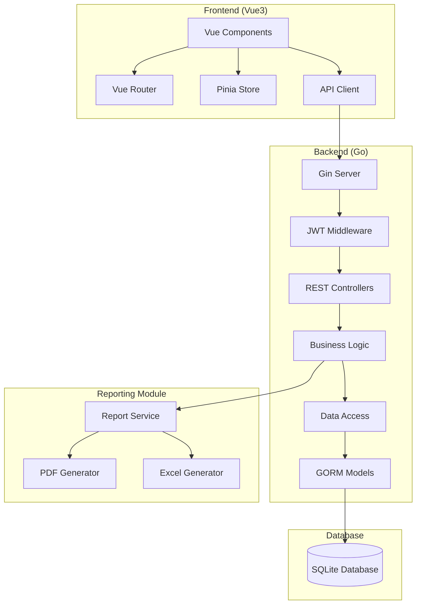

# Task Manager System Architecture

## Project Overview
A full-stack task management application with Go backend, Vue3 frontend, SQLite database, and comprehensive reporting features.

## Technology Stack

### Backend (Go)
- **Framework**: Go 1.21+ with Gin web framework
- **ORM**: GORM with SQLite driver
- **Authentication**: JWT with bcrypt password hashing
- **Validation**: Go validator
- **PDF Generation**: gofpdf or wkhtmltopdf
- **Excel Generation**: excelize or tealeg/xlsx
- **Configuration**: Viper for environment variables
- **Logging**: Zap or Logrus

### Frontend (Vue3)
- **Framework**: Vue 3 with Composition API
- **Build Tool**: Vite
- **UI Framework**: Tailwind CSS
- **Component Library**: Headless UI or custom components
- **State Management**: Pinia
- **HTTP Client**: Axios
- **Routing**: Vue Router 4
- **Form Validation**: Vee-Validate
- **Charts**: Chart.js for reporting visualizations

### Database
- **Primary**: SQLite (file-based for simplicity)
- **Schema**: Normalized relational design
- **Migrations**: GORM AutoMigrate with manual migration scripts

### DevOps
- **Containerization**: Docker + Docker Compose
- **CI/CD**: GitHub Actions (optional)
- **Monitoring**: Prometheus metrics (optional)

## System Architecture Diagram

## Core Components

### 1. Authentication & Authorization Module
- JWT token generation/validation
- Role-based access control (Admin, Manager, Member)
- Password reset functionality
- Session management

### 2. User Management
- User registration/profile management
- Team creation and management
- Role assignment
- Activity tracking

### 3. Project Management
- Project creation/editing/deletion
- Project categorization
- Progress tracking
- Timeline management

### 4. Task Management
- Task creation with priorities (Low, Medium, High, Critical)
- Subtask hierarchy
- Due dates and reminders
- Status workflow (Todo, In Progress, Review, Done)
- Time tracking (optional)

### 5. Delegation System
- Task assignment to team members
- Permission levels for task access
- Notification system for assignments
- Approval workflows

### 6. Reporting Module
- Weekly performance reports
- Task completion analytics
- Time spent analysis
- Export to PDF and XLSX formats
- Custom report filters

## Database Schema

### Core Tables
1. **users** - User accounts and profiles
2. **roles** - Role definitions (Admin, Manager, Member)
3. **projects** - Project information
4. **tasks** - Main task records
5. **subtasks** - Subtask hierarchy
6. **assignments** - Task delegation records
7. **time_entries** - Time tracking (optional)
8. **comments** - Task discussions
9. **attachments** - File attachments
10. **reports** - Generated report metadata

## API Endpoints Structure

### Authentication
- `POST /api/auth/register` - User registration
- `POST /api/auth/login` - User login
- `POST /api/auth/refresh` - Refresh JWT token
- `POST /api/auth/logout` - User logout

### Users
- `GET /api/users` - List users (admin only)
- `GET /api/users/:id` - Get user profile
- `PUT /api/users/:id` - Update user profile
- `DELETE /api/users/:id` - Delete user (admin only)

### Projects
- `GET /api/projects` - List projects
- `POST /api/projects` - Create project
- `GET /api/projects/:id` - Get project details
- `PUT /api/projects/:id` - Update project
- `DELETE /api/projects/:id` - Delete project
- `GET /api/projects/:id/tasks` - Get project tasks

### Tasks
- `GET /api/tasks` - List tasks with filters
- `POST /api/tasks` - Create task
- `GET /api/tasks/:id` - Get task details
- `PUT /api/tasks/:id` - Update task
- `DELETE /api/tasks/:id` - Delete task
- `POST /api/tasks/:id/assign` - Assign task to user
- `POST /api/tasks/:id/complete` - Mark task as complete

### Reports
- `GET /api/reports/weekly` - Generate weekly report
- `POST /api/reports/generate` - Generate custom report
- `GET /api/reports/:id/pdf` - Download PDF report
- `GET /api/reports/:id/excel` - Download Excel report

## Security Considerations
- JWT tokens with short expiration
- Password hashing with bcrypt
- Input validation and sanitization
- SQL injection prevention (GORM parameterized queries)
- CORS configuration for frontend
- Rate limiting for API endpoints

## Deployment Strategy
1. **Development**: Local SQLite, hot-reload for frontend
2. **Production**: Docker containers with volume mounts for SQLite
3. **Scaling**: Potential migration to PostgreSQL for production

## Next Steps
1. Create detailed project structure
2. Set up Go modules and dependencies
3. Initialize Vue3 project with Vite
4. Implement database migrations
5. Build core authentication system